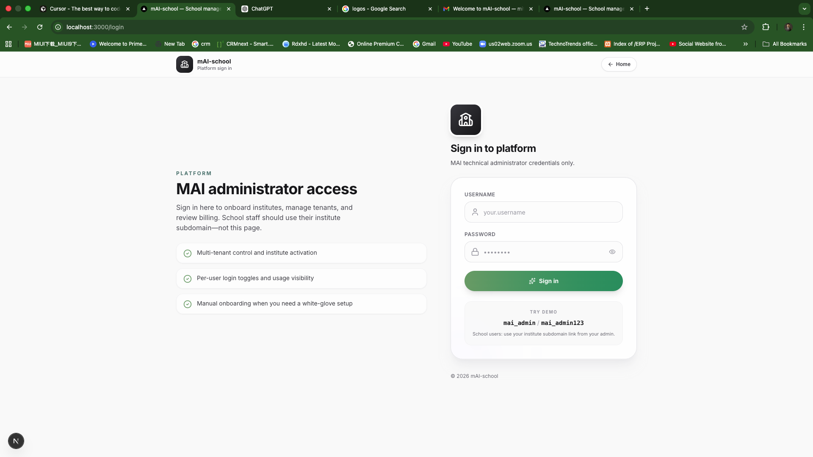
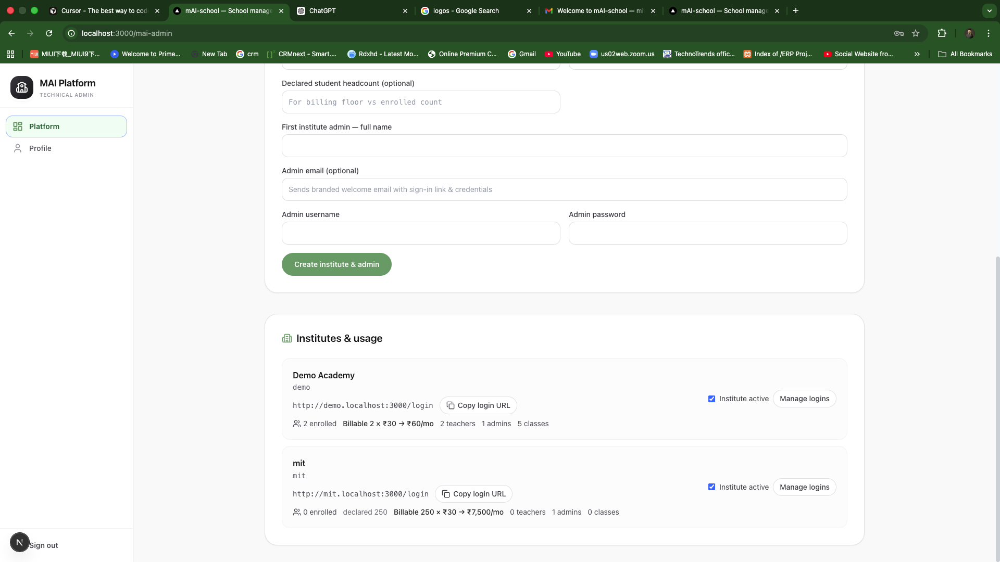
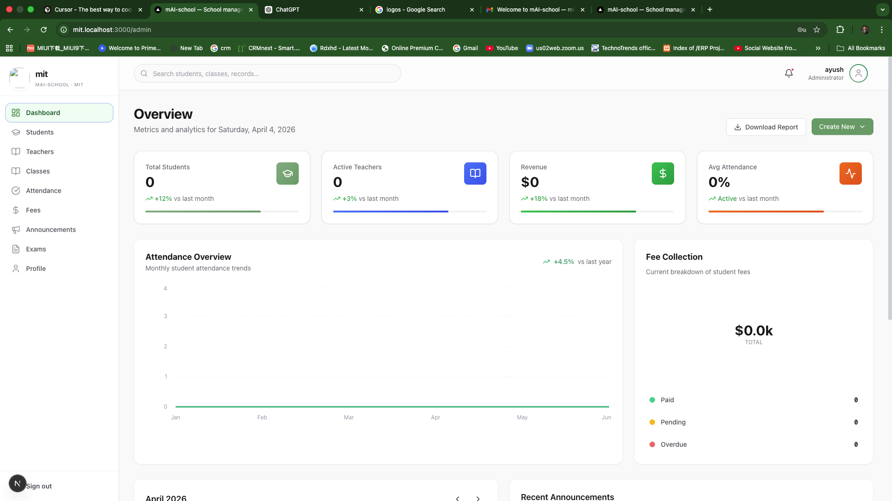
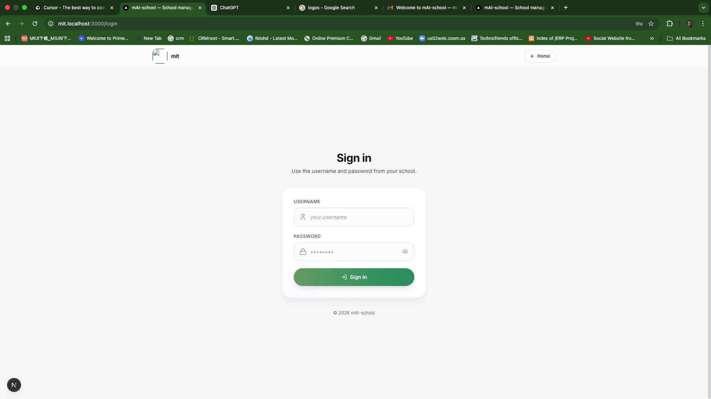

  

  <strong>School management in your brand colors</strong> — sage greens, soft surfaces, and flows that match how institutes really work.

 

---

### At a glance

| | |
|:--|:--|
| **Dashboard** | See attendance, fees, and what needs attention today. |
| **Your URL** | Each institute signs in on its own subdomain — with your name and logo. |
| **Roles** | Admin, principal, teacher, and student each get a focused home. |
| **Start fast** | Self-serve onboarding or a guided setup — same product underneath. |

---

### Inside the app

  <b>Institute sign-in</b> — your school’s name and logo on a calm, green-forward screen  
  

 

  <b>Admin home</b> — run the institute from one place  
  

 

  <b>Dashboard pulse</b> — attendance, fees, and what needs attention today  
  

 

  <b>Secure access</b> — clear sign-in for administrators  
  

 

---

### How it works — simple steps

**For a new institute**

1. **Visit** the main mAI-school site and choose **Start online** (or talk to the team for a guided setup).  
2. **Enter** your institute name, subdomain, optional logo, expected students, and your first admin details (including email).  
3. **Receive** your sign-in link and credentials — on screen and by **email**, in the mAI-school style.  
4. **Open** your institute URL and **sign in** — then add classes, people, fees, and announcements when you’re ready.

**For staff and students**

1. **Use only** the link your school gives you (your institute’s subdomain — not the main marketing site).  
2. **Sign in** with the username and password from your administrator.  
3. **Work** from your role’s dashboard — teachers mark attendance and exams; students see results and messages; leaders see the wider picture.

**For platform operations**

1. **Sign in** on the **main platform** URL as MAI admin.  
2. **Onboard** institutes manually when needed, copy shareable login links, and turn access on or off.  
3. **Review** usage and estimated billing across tenants in one place.

---

### What you get

- **Attendance** — present, absent, late, with history you can trust.  
- **Fees** — what’s due, paid, or overdue — clearer for the office and families.  
- **Exams & results** — schedule, record marks, and share feedback.  
- **Announcements** — reach everyone, or just students or staff.  
- **Meetings** — keep parent and student conversations on the calendar.  
- **Smart assists** — AI where it saves time on drafting and summaries.  

---

  Screenshots from the mAI-school app (docs/readme).

   
  <b>mAI-school</b> — <i>less admin drag. More time for learning.</i>

