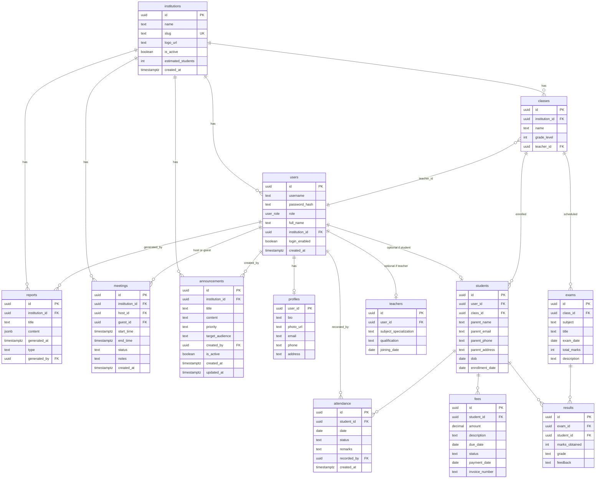

# Entity–Relationship diagram — mAI-school

> Source of truth: `server/db/schema.sql`. Cardinalities are approximate (one user can be one teacher row OR one student row depending on role).

## 1. ER diagram (Mermaid)

## 2. Constraints (selected)

| Entity | Rule |
|--------|------|
| `users` | `mai_admin` ⇒ `institution_id IS NULL`; other roles ⇒ `institution_id NOT NULL` |
| `users` | Unique `(institution_id, username)`; global unique username for `mai_admin` |
| `institutions.slug` | Regex `^[a-z0-9]([a-z0-9-]{0,62}[a-z0-9])?$` |
| `attendance` | Unique `(student_id, date)` |
| `fees.status` | `paid` / `pending` / `overdue` |
| `results` | FK to `exams`; cascade delete from exam |

## 3. Enum

**`user_role`:** `mai_admin`, `admin`, `principal`, `teacher`, `student`.

## 4. Derived / helper functions (not entities)

`register_user`, `register_student`, `register_teacher`, `upsert_profile`, `update_user_name`, announcement CRUD functions, `modify_class`, `remove_student`, etc. — see schema file.
