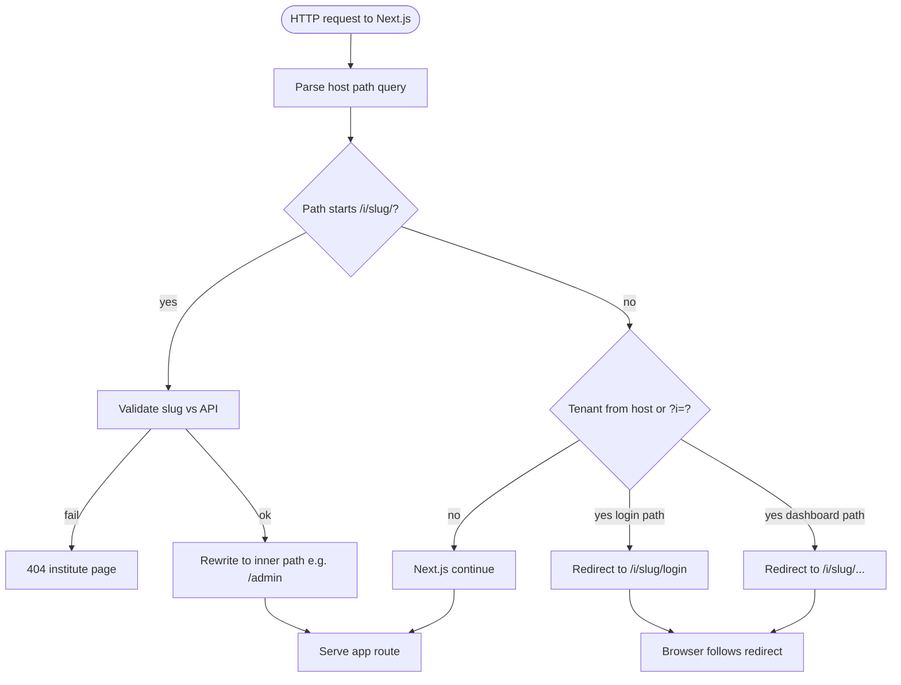
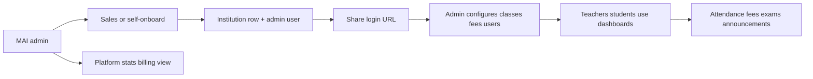
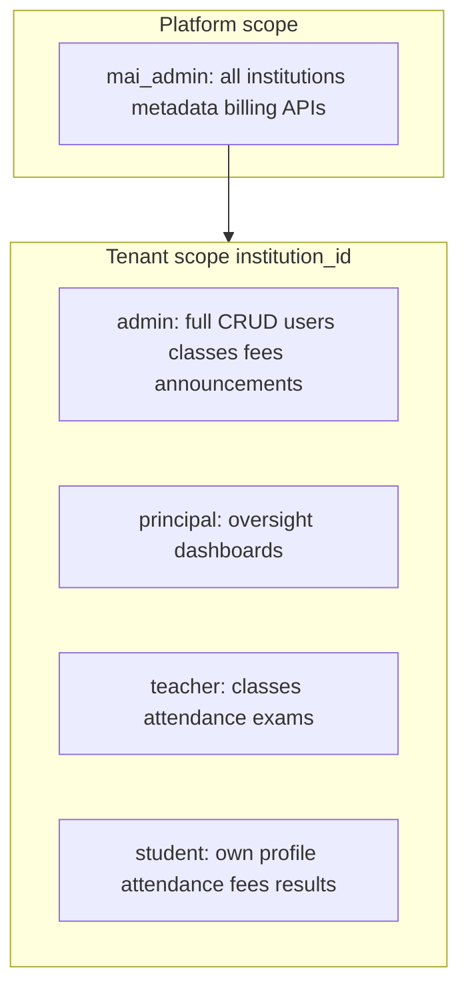
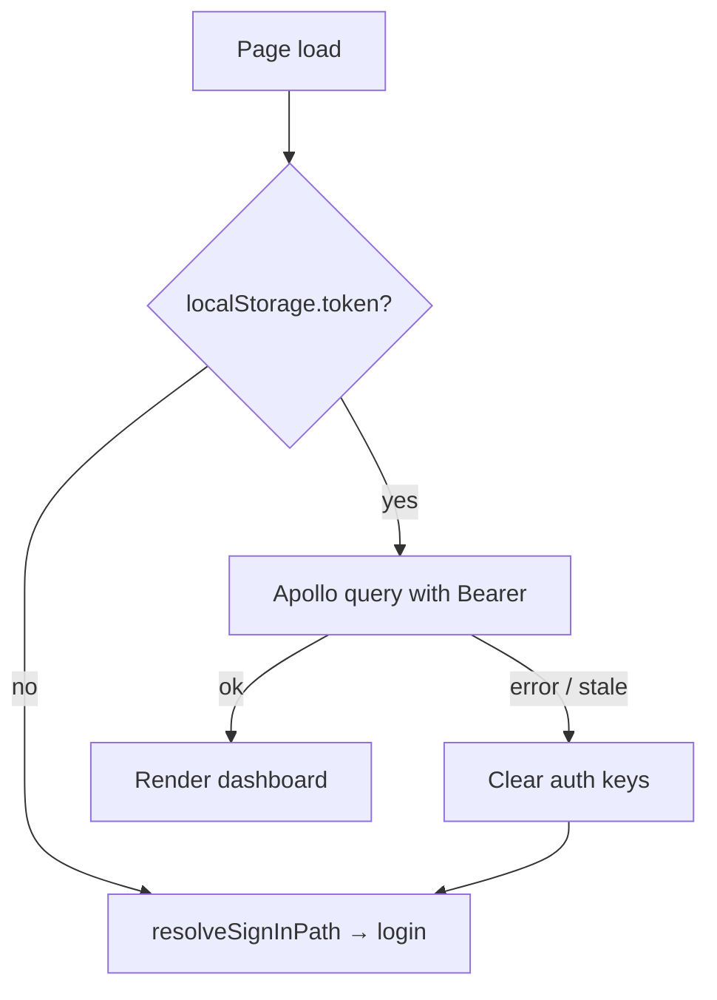
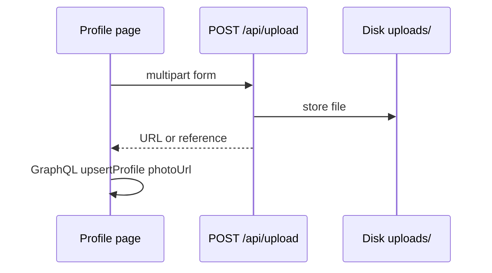

# Flow diagrams — mAI-school

## 1. Request routing (tenant awareness)



## 2. Role-based navigation after login

```mermaid
flowchart TD
  L[Login success] --> R{role}
  R -->|mai_admin| MA[/mai-admin]
  R -->|admin| AD["/i/slug/admin"]
  R -->|teacher| TE["/i/slug/teacher"]
  R -->|principal| PR["/i/slug/principal"]
  R -->|student| ST["/i/slug/student"]
```

*(If `slug` missing, `tenantAppPath` falls back to unprefixed path; middleware may redirect on tenant host.)*

## 3. Institute lifecycle (business)



## 4. Data ownership by role (conceptual)



## 5. Client state for authenticated pages



## 6. File upload (profile image)



*(Exact response shape: see `server/routes/upload.js`.)*
