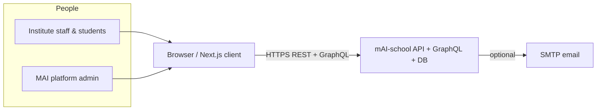
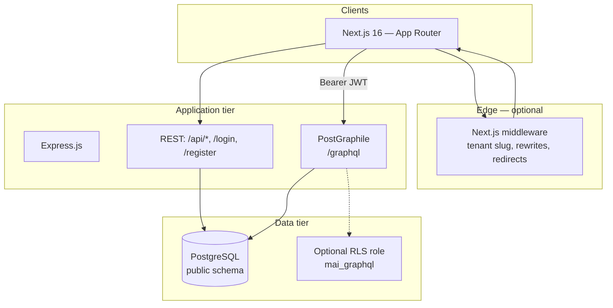

# High Level Design (HLD) — mAI-school

## 1. Purpose

**mAI-school** is a **multi-tenant** school management system: each **institute** (tenant) has isolated data, branded login, and role-based dashboards for platform operators (`mai_admin`), institute staff (`admin`, `principal`, `teacher`), and `student`.

## 2. System context

## 3. Logical architecture

### Responsibilities

| Layer | Responsibility |
|-------|----------------|
| **Next.js client** | Marketing (`/`), onboarding (`/onboarding`), login (`/login`), institute-scoped paths (`/i/{slug}/…`), dashboards (`/admin`, … internally rewritten), Apollo GraphQL, `localStorage` session |
| **Middleware** | Resolve tenant slug (host, `?i=`, `/i/slug/…`); validate institute via `GET /api/public/institution/:slug`; set `x-tenant-slug`; canonical redirects |
| **Express** | REST auth, public onboarding, platform admin APIs, uploads, AI mocks, attendance email hooks |
| **PostGraphile** | CRUD + custom mutations as GraphQL; JWT injected into PostgreSQL session settings for RLS policies when `mai_graphql` is used |

## 4. Tenancy model

- **Physical isolation:** single database, **logical** isolation by `institution_id` on tenant-scoped rows; `mai_admin` users have `institution_id IS NULL`.
- **URL isolation:** users are steered to institute-specific login URLs; platform login is apex-only for `mai_admin`.
- **GraphQL:** tenant visibility enforced by **Row Level Security** policies (when enabled) using JWT claims set per request.

## 5. Security (high level)

| Concern | Approach |
|---------|----------|
| Authentication | Username/password against `users.password_hash` (`crypt`); JWT for API |
| Authorization | Role in JWT; RLS policies for `mai_graphql`; `create_announcement` etc. check `rls_jwt_institution_id()` |
| Transport | HTTPS in production (assumed) |
| File upload | Server-controlled storage under `uploads/` |

## 6. External dependencies

- **PostgreSQL** — primary store  
- **SMTP** — transactional email (welcome, attendance, etc.)  
- **No mandatory third-party auth** — custom users table  

## 7. Non-functional notes

- Client uses **responsive** layouts; institute paths prefixed with `/i/{slug}` for clarity on shared hosts.  
- **Billing** notion: INR per student per month with `estimated_students` on `institutions` for platform views.  
- **AI** routes are **mocked** for demo (attendance image, report generation).
