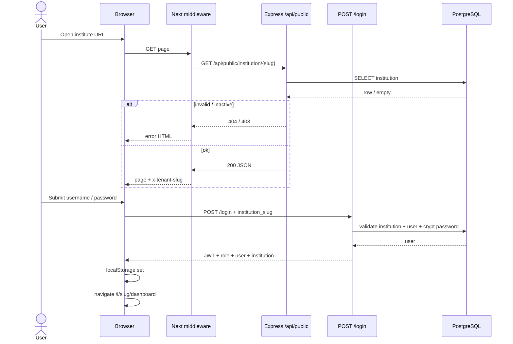
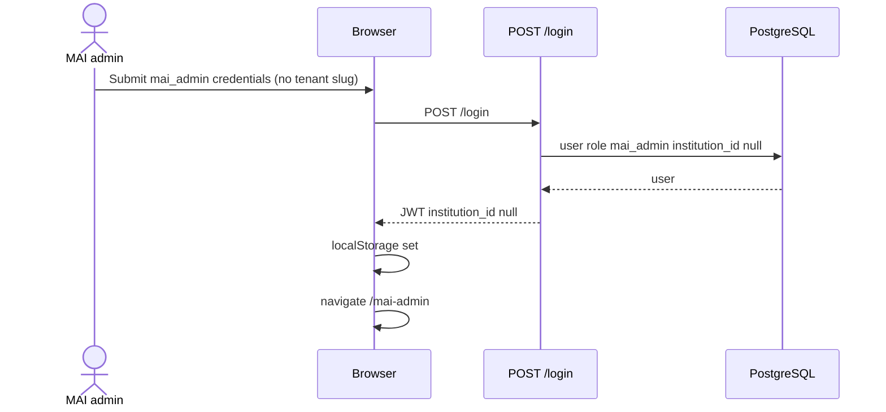
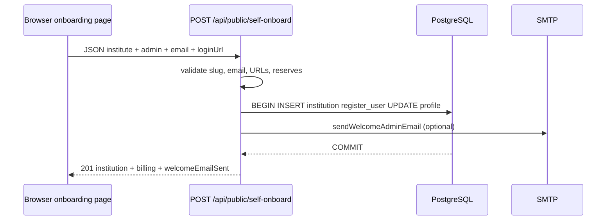
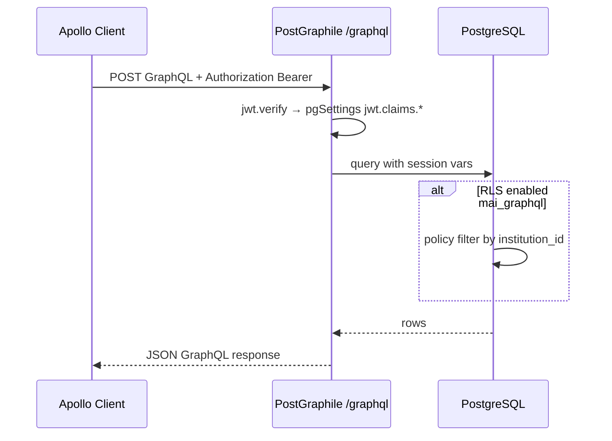
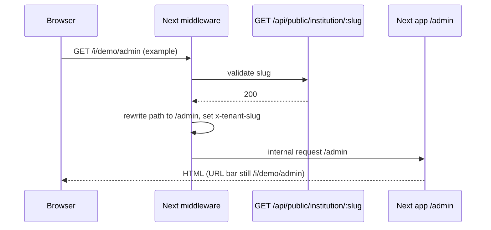
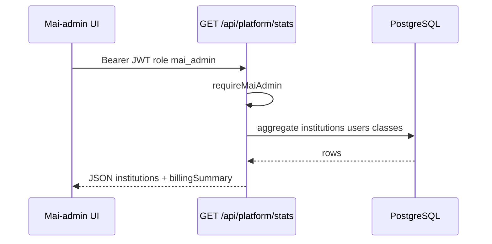
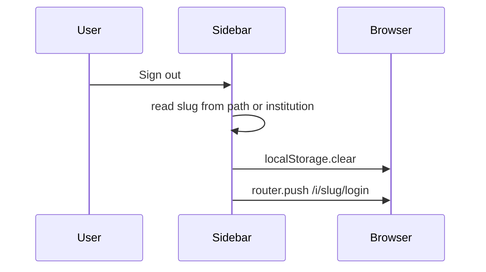

# Sequence diagrams — mAI-school

## 1. Institute user login (subdomain or `/i/{slug}/login`)

## 2. MAI platform admin login (apex `/login`)

## 3. Self-service onboarding

## 4. GraphQL query (authenticated)

## 5. Middleware: canonical path `/i/slug/...` → internal route

## 6. MAI admin: platform stats

## 7. Sign out (institute session)

